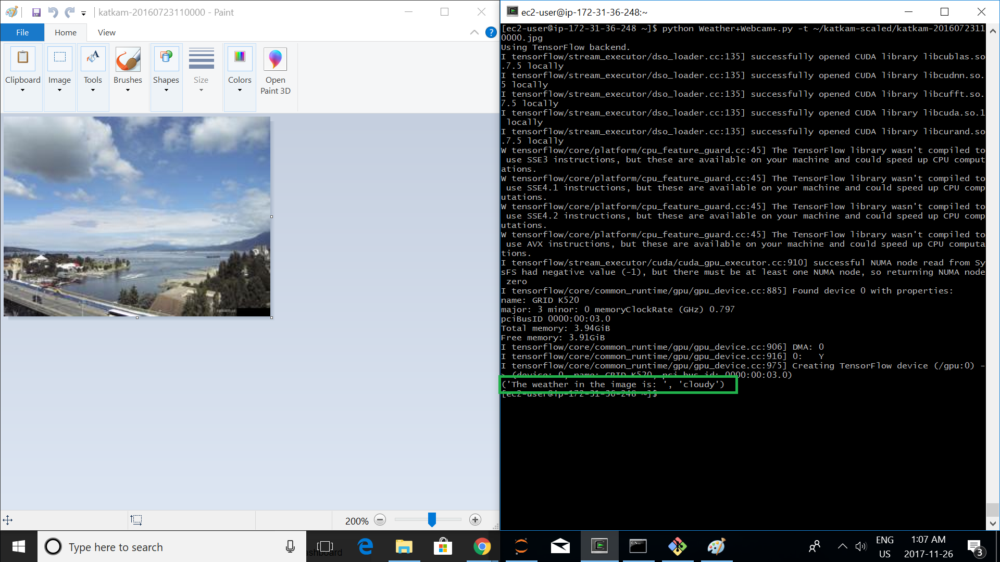
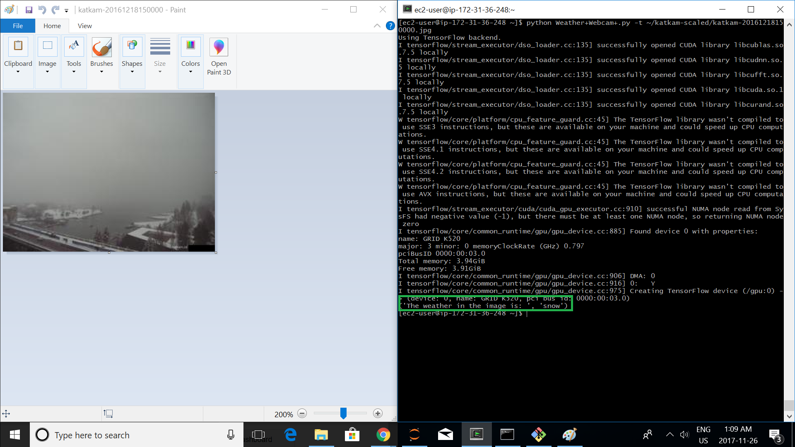

# Webcams, Predictions, and Weather

Weather-Image Classifier processes the YVR-weather and KatKam image data into training and validation datasets, extracts image features from a VGG16 CNN, and then runs machine learning algorithms on the features.

## Getting Started

Follow instructions below.

### Prerequisites

Python2.7 (Keras predict_gen has issues with Python3)
Tensorflow
Theanos
Keras

1. Download, extract, and move the 'katkam-scaled' folder into the main folder.

2. Download, extract, and move the 'yvr-weather' folder into the main folder.

3. In CLI, run python Weather+Webcam+.py. 

Directory Structure:

- Main/ (Directory containing Weather+Webcam+.py)
 - katkam-scaled/
 - yvr-weather/
 
### Running Weather-Image-Classifier

```
Weather+Webcam+.py [-p] [-vgg16] [-n] [-s] [-r] [-t PREDICT_IMG] [-h]
```
##### Arguments:

  -p, --process_data    [Run this first time to process the image and weather
                        dataset.]
                        
  -vgg16, --get_features_from_vgg16
                        [Run this the first time to extract features from the
                        image dataset off VGG16.]
                        
  -n, --test_neuralnet  [Run this to test the features on a neural net.]
  
  -s, --test_svm        [Run this to test the features on a svm.]
  
  -r, --test_randomforest
                        [Run this to test the features on a random forest.]
                        
  -t [filename], --predict_img [filename]
                        [Run the rf classifier to predict the weather on the
                        img.]
                        
  -h, --help            [Show this message and exit.]
  
##### Must run --process_data --get_features_from_vgg16 first time to process datasets and extract features.

### Results

#### Neural Net Score on Features: 
Train on 960 samples, validate on 320 samples

Epoch 50/50

960/960 [==============================] - 0s - loss: 0.1973 - acc: 0.9281 - val_loss: 0.2141 - val_acc: 0.9375

#### Random Forest score on features:
('random forest accuracy on validation data: ', 0.94374999999999998)


### Image Predictions




